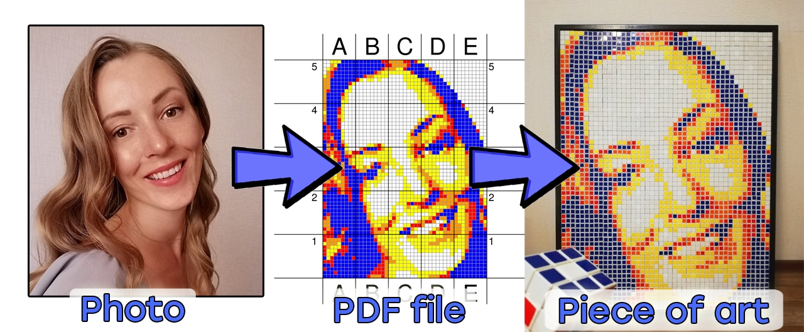
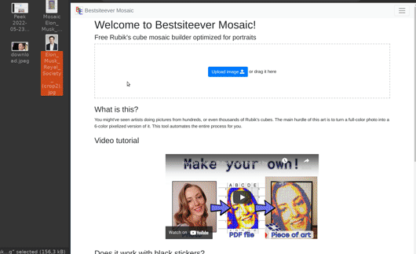
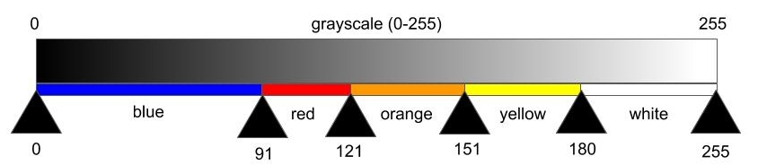

# Rubik's cube mosaic builder

**Discussion, feature suggestions, bug reports: welcome to our [Discord Server](https://discord.gg/8psRGEvyEj)**

## Demo

## Project structure
Js files are in js/ directory. `init.js` is for initialization. `layouts.js` has functions like `loXYZ()`, which are layouts. `glob.js` contains global variables and parameters, including `Glob.chooseSets()` that defines methods and parameters used for making different mosaic pictures. `pdfcomposer.js` has funcs to compose the PDF file with [jspdf](https://github.com/MrRio/jsPDF "jspdf") lib.

## General workflow

First thing that happens when the page is loaded (see js/init.js) is the Cropper layout (`loCropper()`). User can crop image, the [cropperjs](https://github.com/fengyuanchen/cropperjs "cropperjs") lib is used. When cropping is done, `ImageData` is retreived from cropped picture for further processing and `loChoose()` is displayed. There, users sees multiple canvases obtained by transforming the cropped and resized image with *methods* (see below). Each canvas corresponds to one of the chooseSet objects from `Glob.chooseSets()`.

When user clicks on one canvas, he chooses the *method* and initial parameters for this method. `lo2ndChoice(...)` is then shown. There, a bunch of new canvases are displayed with same method but slightly different parameters.

When user made his final choice, `loAdjustPortrait()` is shown. There, he can enter parameter(s) values manually and download PDF.

## Methods
There are 3 methods used to make 6-color mosaic picture from the original picture.

- Gradient
- Dithering
    - error diffusion
    - ordered dither
    - atkinson dither
- Closest color

### Gradient

Gradient method takes grayscale image and replaces each tone to the corresponding color from the palette. By default, green color isn't used because it does not look good in portraits. The parameters for gradient method are ranges - an array of (N-1) numbers that define the borders for tone-color match. (N is number of colors in the palette).

The way these ranges are generated in the code are a bit obscure: instead of manually enter an array of ranges (which would require hardcoding the palette size), we generate the uniform range (ranges.js -> `createUniformRange(...)`) and apply scale/offset (`initialRangePopulation(...)`). When user chooses a picture created with this gradient method, the ranges are changed (`populateSetOfRanges(...)`) by scale/offset, and also each range is moved back and forth to create new variations of the image.

### Dithering
Dithering is done with [ditherjs](https://danielepiccone.github.io/ditherjs/ "ditherjs") lib. There isn't really much more to say about it. These functions, slightly simplified, are located in js/ditheralgs.js.

Sometimes it's good to exclude certain color(s) from the palette. This option is presented in palette.js -> `getAllDitherPalettes()`, which produces several palettes, each of them has all but one colors.

Also: atkinson dithering is not used in this software because the result it produces is very close to *error diffusion* dithering, so I don't bother user making choice between visually identical results.

### Closest color
`closestColorDither(...)` replaces colors in each pixel of the resized image to its closest color from the palette. This also happens automatically when user uploads *miniature* (see layouts.js -> `onImageHasBeenLoaded()` and `onMiniatureUploaded()`).
